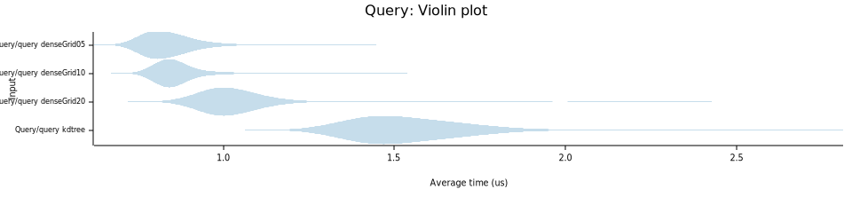
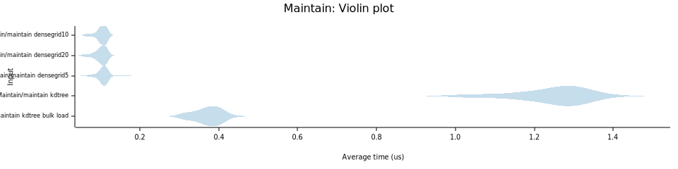

# flat_spatial

[](https://github.com/Uriopass/flat_spatial/actions)
[](https://crates.io/crates/flat_spatial)
[](https://docs.rs/flat_spatial)

flat_spatial is a crate dedicated to dynamic spatial partitioning structures that are not based on trees
(which are recursive) but on simple flat structures such as a grid/hashmap of cells.  
Using grids or other flat structures makes for very fast updates (constant time) and
even fast queries, provded they are adapted to the structure.

At the moment, only the dense grid is implemented.

## DenseGrid


The idea of a dense grid is to have an array of cells which store the positions 
of the inserted objects.  
Performing queries is as simple as looking up which cells are affected and returning 
their associated objects.  
Since it's so simple, the dense grid supports dynamic capabilities such as position update
or object removal based on handles (using `slotmap`).

It is recommended to have queries roughly the same size as the cell size.

### Benchmarks

Here's some basic benchmarks of densegrid vs rstar's r-trees using criterion:

The first one adds 100'000 random points on a 500x500 square and perform _n_ random 
queries of radius 5.

denseGridN means the structure is a DenseGrid where cells are of size N.  

Time is shown _per query_, lower is better:



The second benchmark tries to change the position of _n_ objects in a 500x500 square.

For an r-tree, it means building it up from scratch.   
For a DenseGrid, set_position is used on all handles with a new random position
then maintain() is called.

Time is shown _per object_, lower is better:



_Note: In both benchmarks, r-trees and densegrids are linear 
in number of objects/queries. That's why it makes sense to show the average time
per object/per query._

### Example

Here is an example of a densegrid usage for a (very simple) collision detector:

```Rust
use flat_spatial::DenseGrid;

// A structure has to be copy in order to be in a dense grid, because of slotmap's requirements. 
// This is subject to change
#[derive(Copy, Clone)]
struct Car {
    direction: [f32; 2],
}

fn main() {
    // Creates the grid with cell size 10
    let mut g: DenseGrid<Car> = DenseGrid::new(10);
    
    // create objects in the range x: [-50..50], y: [-50..50]
    for _ in 0..100 {
        let pos = [100.0 * rand::random::<f32>() - 50.0, 100.0 * rand::random::<f32>() - 50.0];
        let magn = (pos[0].powi(2) + pos[1].powi(2)).sqrt();
        g.insert(
            pos,
            Car {
                direction: [-pos[0] / magn, -pos[1] / magn],
            },
        );
    }

    loop {
        update_loop(&mut g);
    }
}

fn update_loop(g: &mut DenseGrid<Car>) {
    let handles: Vec<_> = g.handles().collect();
    // Handle collisions (remove on collide)
    for &h in &handles {
        let (pos, _car) = g.get(h).unwrap();

        let mut collided = false;
        for (other_h, other_pos) in g.query_around(pos, 8.0) {
            if other_h == &h {
                continue;
            }
            if (other_pos.x - pos.x).powi(2) + (other_pos.y - pos.y).powi(2) < 2.0 * 2.0 {
                collided = true;
                break;
            }
        }
        
        if collided {
            g.remove(h);
        }
    }

    // Update positions
    for &h in &handles {
        let (pos, car) = g.get(h).unwrap();
        g.set_position(h, [pos.x + car.direction[0], pos.y + car.direction[1]])
    }

    // Handle position updates and removals
    g.maintain();
}
```